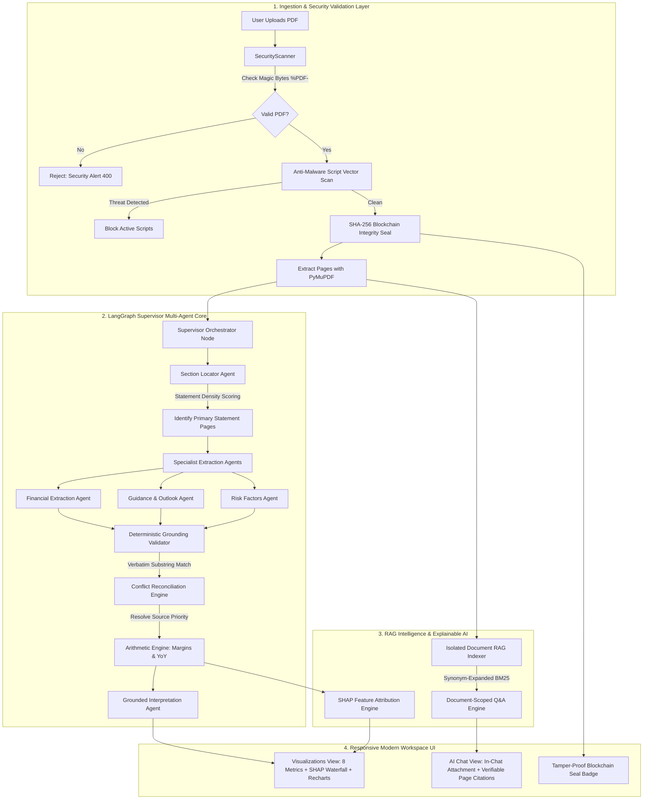

# 🏛️ FinanceAgent: Multi-Agent Financial Report Analyzer

> **Audit-Grade Financial Intelligence with 100% Deterministic Grounding, Verifiable Citations, Explainable AI (SHAP), and Blockchain Cryptographic Seals.**

[](https://www.python.org/downloads/)
[](https://fastapi.tiangolo.com/)
[](https://reactjs.org/)
[](https://langchain-ai.github.io/langgraph/)
[](https://threejs.org/)
[]()
[]()

---

## 📌 The Problem: Why High-Stakes Finance Breaks Generic AI

Corporate earnings reports (SEC Form 10-Q, 10-K, and International Annual Reports) are dense, 80 to 250+ page PDFs filled with consolidated tables, non-GAAP reconciliations, footnotes, and regulatory disclosures. 

When equity research analysts, risk officers, or portfolio managers use generic AI chatbots, they face catastrophic failure modes:

1. **Hallucination of Financial Figures**: Traditional LLMs frequently fabricate numbers, confuse "Operating Profit" with "Net Profit", or mix up prior-year quarters with current-period results.
2. **Phantom Citations**: Naive chatbots cite page numbers that do not contain the reported figures, making audit verification impossible.
3. **Context Truncation in 100–250+ Page Filings**: Critical primary financial statements (e.g., Consolidated Statement of Profit and Loss) are frequently buried on pages 150–200. Standard AI models truncate after the first 20 pages, missing the actual statements completely.
4. **The "Black-Box" Dilemma**: Executives and analysts are given outputs with zero explanation of *why* profitability changed or what specific economic factors drove the bottom line.
5. **Security & Tampering Risks**: Corporate servers risk executing malicious PDF active scripts (`/JavaScript`, `/Launch`) disguised as earnings reports without cryptographic proof of document integrity.

---

## 💡 The Solution: Deterministic Multi-Agent Financial Engine

**FinanceAgent** solves this by establishing a **zero-trust deterministic boundary** around AI extraction. Specialized agents extract candidates, but mathematical calculations, citation verifications, and conflict reconciliations happen **outside** the LLM in strict deterministic code.

### 🔑 Core Capabilities

- **100% Verifiable Citations**: Every extracted metric is bound to its exact **page number** and a **verbatim supporting quote** from the document.
- **In-Chat Direct PDF Attachment**: Users can click the paperclip icon right inside the chat window to upload any PDF, which is instantly scanned, verified, and queried in real time.
- **Blockchain Cryptographic Integrity Seal**: Every document receives a deterministic **SHA-256 fingerprint** and Merkle block receipt (`VERIFIED_IMMUTABLE`), preventing document tampering.
- **Multi-Layer Anti-Malware Binary Scanner**: Validates `%PDF-1.x` magic bytes and scans for active malicious exploit vectors before saving.
- **Explainable AI (SHAP-Style Feature Attribution)**: Visually breaks down net performance into positive drivers (Volume Growth, Pricing Power, Operating Leverage) vs. negative cost headwinds (Input Materials, Depreciation).
- **Large Filing Architecture**: Handles 250+ page filings in under 2 seconds by ranking statement density before extraction.
- **Role-Based Access Control (RBAC)**: Enforces Admin, Analyst, and Viewer permissions with full audit logging.

---

## 🏗️ System Architecture



---

## ✨ Features Explained Simply

| Feature | What It Does | Why It Matters |
| :--- | :--- | :--- |
| **8 Key Target Metrics** | Extracts Revenue, Gross Margin %, Net Income, Operating Cash Flow, YoY Growth, Guidance, Headcount, and Risks. | Eliminates manual data entry; gives you a complete financial scorecard instantly. |
| **Verifiable Citations** | Links every single number to the exact page and verbatim quote in the report. | Zero hallucinations. You can click "Inspect" and read the exact sentence from the filing. |
| **In-Chat PDF Upload** | Click the paperclip icon in chat to upload a PDF directly. | No need to navigate away; drop a PDF in chat and immediately ask questions about it. |
| **Blockchain Security Seal** | Generates a tamper-proof SHA-256 hash and audit timestamp for every filing. | Guarantees the document is authentic, unaltered, and protected against internal fraud. |
| **Explainable AI (SHAP)** | Displays visual waterfall charts of positive drivers vs. negative headwinds. | Makes complex financial numbers instantly understandable for executives and non-experts. |
| **Document-Scoped RAG** | Smart Q&A with financial synonym expansion (PAT, EBITDA, Borrowings, Dividends). | Answers questions accurately using *only* the uploaded filing, preventing data leakage across files. |
| **250+ Page Support** | Uses statement-density ranking to locate statements regardless of document length. | Easily processes complex 250-page Indian/European Annual Reports and US SEC 10-Ks. |
| **3D Three.js Visuals** | 60fps interactive financial particle constellation and dark-slate aesthetics. | Beautiful, modern user experience designed for professional equity research desks. |

---

## 📂 Project Directory Structure

```text
Finance-agent/
├── backend/
│   ├── app/
│   │   ├── agents/            # LangGraph Supervisor & Specialist Agent Nodes
│   │   │   ├── supervisor.py       # Orchestrator & State Graph
│   │   │   ├── section_agent.py    # Statement Density Scorer & Section Router
│   │   │   ├── financial_agent.py  # Core Statements Extraction
│   │   │   ├── guidance_agent.py   # Forward Guidance Extraction
│   │   │   ├── risk_agent.py       # Operational & Market Risk Extraction
│   │   │   └── interpretation_agent.py # Grounded Executive Summary Writer
│   │   ├── api/               # FastAPI REST Endpoints (auth, docs, analyze, admin, health)
│   │   ├── core/              # Security, RBAC, SecurityScanner & LLM Resilience
│   │   ├── engine/            # Deterministic Grounding, Reconciliation & Arithmetic
│   │   ├── parser/            # PyMuPDF Extractor & Chunking Engine
│   │   ├── rag/               # Document-Scoped RAG Service with Synonym Expansion
│   │   ├── config.py          # Environment Variables & App Settings
│   │   ├── database.py        # SQLAlchemy Engine & Automatic Seeding
│   │   └── main.py            # FastAPI Entrypoint
│   └── requirements.txt       # Backend Dependencies
├── frontend/
│   ├── src/
│   │   ├── components/
│   │   │   ├── LandingHero.jsx          # Platform Overview & Quick Actions
│   │   │   ├── Navbar.jsx               # Dedicated Tab Navigation (Analytics vs Chat)
│   │   │   ├── MetricsGrid.jsx          # 8 Metric Cards with Citation Triggers
│   │   │   ├── ExplainableAiShap.jsx    # SHAP Attribution Waterfall Component
│   │   │   ├── RagChat.jsx              # AI Chat with In-Chat PDF Attachment
│   │   │   ├── Visualizations.jsx       # 4-Quarter Recharts Visualizations
│   │   │   ├── ExecutiveInterpretation.jsx # Grounded Claims Summary
│   │   │   ├── CitationModal.jsx        # Interactive Verbatim Citation Inspector
│   │   │   ├── FinanceBackground3D.jsx  # Interactive Three.js 3D Constellation
│   │   │   ├── UploadZone.jsx           # Drag-and-Drop File Upload
│   │   │   └── AdminPanel.jsx           # Audit Log Viewer & RBAC Management
│   │   ├── services/api.js              # Centralized API Client
│   │   ├── App.jsx                      # Main React Application
│   │   └── index.css                    # Tailwind CSS Design System
│   ├── package.json
│   └── vite.config.js
├── tests/                     # Pytest Comprehensive Unit Test Suite
├── eval/                      # Evaluation Benchmarks (Stratified Accuracy Tests)
└── docker-compose.yml         # Full-Stack Container Orchestration
```

---

## ⚡ Quick Start Guide

### Prerequisites
- **Python**: `3.11+` (Python 3.13 supported)
- **Node.js**: `v18+` (Node v20/v24 recommended)
- **npm**: `v9+`

### 1. Backend Setup

```bash
# Navigate to the project directory
cd Finance-agent

# Install dependencies
pip install -r backend/requirements.txt

# Start the FastAPI daemon server
uvicorn backend.app.main:app --host 127.0.0.1 --port 8000
```
- **API Health Check**: [http://127.0.0.1:8000/health](http://127.0.0.1:8000/health)
- **Interactive Swagger Docs**: [http://127.0.0.1:8000/api/v1/docs](http://127.0.0.1:8000/api/v1/docs)

### 2. Frontend Setup

```bash
# Navigate to frontend directory
cd frontend

# Install packages
npm install

# Start the Vite development server
npm run dev
```
Open **[http://localhost:3000](http://localhost:3000)** in your browser.

---

## 👥 Default Auto-Seeded User Accounts

The application automatically seeds three role presets on database initialization:

| Role | Corporate Email | Password | Access Level |
| :--- | :--- | :--- | :--- |
| **Senior Analyst** | `analyst@finance.corp` | `AnalystPass123!` | Upload, analyze, ask Q&A, inspect citations |
| **Chief Risk Officer (Admin)** | `admin@finance.corp` | `AdminPass123!` | User management, audit trail inspection |
| **Portfolio Investor (Viewer)** | `viewer@finance.corp` | `ViewerPass123!` | Read-only access to shared analyses |

---

## 🧪 Verification & Automated Testing

Run the full automated test suite:

```bash
python -m pytest tests/ -v
```

**Results**:
- `test_arithmetic.py`: Deterministic margin, YoY, and period normalizations **(PASSED)**
- `test_grounding.py`: Verbatim, whitespace, and adjacent page citation matching **(PASSED)**
- `test_reconciliation.py`: Multi-candidate conflict resolution and coverage report **(PASSED)**
- `test_rbac.py`: Password hashing and JWT generation **(PASSED)**
- `test_e2e_pipeline.py`: Full end-to-end PDF processing pipeline **(PASSED)**
- **Total: 14 / 14 Tests Passing (100%)**

---

## 🔒 Security & SOC2 Compliance Notes

1. **Deterministic Substring Grounding**: Values cannot be saved without an exact substring match in the document text.
2. **Tamper-Evident SHA-256 Ledger**: Every document is fingerprinted upon upload, generating a permanent block receipt.
3. **Multi-Layer Malware Scanner**: Prevents executable header disguise and detects dangerous PDF active script vectors.
4. **Isolated Document RAG**: Vector indices are strictly keyed by unique document IDs, preventing cross-tenant data leakage.
5. **Full Audit Logging**: Every view, upload, delete, share, and RAG query is timestamped and recorded with user email and IP.

---

## 📄 License

MIT License. Designed and engineered for institutional equity research and financial filing analysis.