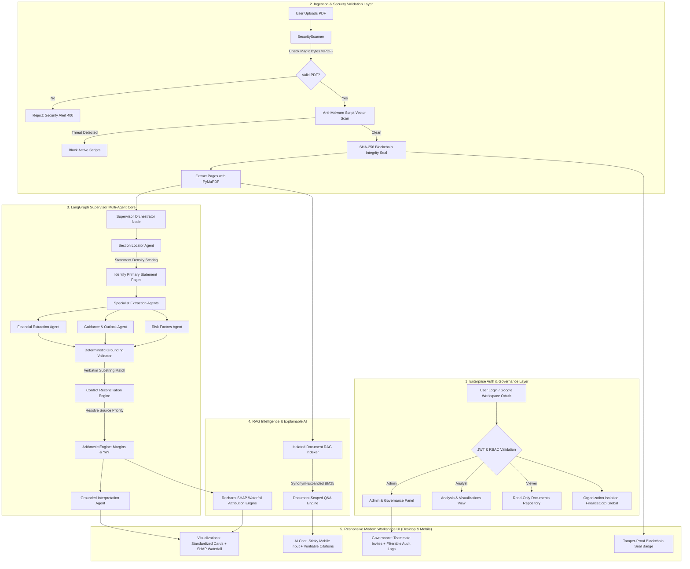

# 🏛️ FinanceAgent: Enterprise Financial Report Analyzer

> **Audit-Grade Financial Intelligence with 100% Deterministic Grounding, Verifiable Citations, Recharts SHAP Waterfall, Blockchain Cryptographic Seals, and Enterprise RBAC.**

[](https://www.python.org/downloads/)
[](https://fastapi.tiangolo.com/)
[](https://reactjs.org/)
[](https://vitejs.dev/)
[](https://langchain-ai.github.io/langgraph/)
[](https://recharts.org/)
[](https://threejs.org/)
[]()
[]()

---

## 📌 The Problem: Why High-Stakes Finance Breaks Generic AI

Corporate earnings reports (SEC Form 10-Q, 10-K, and International Annual Reports) are dense, 80 to 250+ page PDFs filled with consolidated tables, non-GAAP reconciliations, footnotes, and regulatory disclosures. 

When equity research analysts, risk officers, or portfolio managers use generic AI chatbots, they face catastrophic failure modes:

1. **Hallucination of Financial Figures**: Traditional LLMs frequently fabricate numbers, confuse "Operating Profit" with "Net Profit", or mix up prior-year quarters with current-period results.
2. **Phantom Citations**: Naive chatbots cite page numbers that do not contain the reported figures, making audit verification impossible.
3. **Context Truncation in 100–250+ Page Filings**: Critical primary financial statements (e.g., Consolidated Statement of Profit and Loss) are frequently buried on pages 150–200. Standard AI models truncate after the first 20 pages, missing the actual statements completely.
4. **The "Black-Box" Dilemma**: Executives and analysts are given outputs with zero explanation of *why* profitability changed or what specific economic factors drove the bottom line.
5. **Security & Tampering Risks**: Corporate servers risk executing malicious PDF active scripts (`/JavaScript`, `/Launch`) disguised as earnings reports without cryptographic proof of document integrity.
6. **Cross-Tenant Data Leakage**: Without enterprise-level organization boundaries, sensitive pre-release earnings filings risk being exposed across departments or unauthorized roles.

---

## 💡 The Solution: Deterministic Multi-Agent Financial Engine

**FinanceAgent** solves this by establishing a **zero-trust deterministic boundary** around AI extraction. Specialized agents extract candidates, but mathematical calculations, citation verifications, and conflict reconciliations happen **outside** the LLM in strict deterministic code.

### 🔑 Core Capabilities

- **100% Verifiable Citations**: Every extracted metric is bound to its exact **page number** and a **verbatim supporting quote** from the document.
- **Dedicated Corporate Authentication & Google OAuth**: Enterprise sign-in portal supporting Google Workspace OAuth (`/api/v1/auth/google`), role presets for evaluation, and role-based redirect.
- **Enterprise Multi-Tenant RBAC & Governance**: Multi-tenant organization isolation (`FinanceCorp Global`), teammate invitations (`/api/v1/admin/invite`), org-wide document sharing, and filterable audit trails (by action, user email, document ID).
- **Interactive Recharts SHAP Waterfall**: Replaces static progress bars with an interactive waterfall chart breaking down net performance into positive drivers vs. negative cost headwinds with glassmorphic tooltips.
- **Standardized Metric Scorecards**: 8 standardized financial cards with single-line confidence badges, neutral amber coloring for low confidence (red reserved strictly for errors), 4-quarter SVG sparklines, and muted missing disclosures.
- **Cleaned UI & Isolated 3D Visuals**: Three.js particle constellation strictly bounded to the landing hero section—eliminating background noise and card border bleed—with automatic disabling on mobile devices (`< 768px`).
- **Top Nav Profile Dropdown**: Sleek profile avatar with initials, role chip, organization affiliation, and sign-out menu with click-outside auto-dismiss.
- **Mobile-Responsive (375px+ Viewport)**: 2-column mobile metric grid (`grid-cols-2`), pinned bottom navigation bar (`md:hidden`), and sticky chat input in RAG chat.
- **In-Chat Direct PDF Attachment**: Users can click the paperclip icon right inside the chat window to upload any PDF, which is instantly scanned, verified, and queried in real time.
- **Blockchain Cryptographic Integrity Seal**: Every document receives a deterministic **SHA-256 fingerprint** and Merkle block receipt (`VERIFIED_IMMUTABLE`), preventing document tampering.
- **Multi-Layer Anti-Malware Binary Scanner**: Validates `%PDF-1.x` magic bytes and scans for active malicious exploit vectors before saving.
- **Large Filing Architecture**: Handles 250+ page filings in under 2 seconds by ranking statement density before extraction.

---

## 🏗️ System Architecture



---

## ✨ Features Explained Simply

| Feature | What It Does | Why It Matters |
| :--- | :--- | :--- |
| **8 Key Target Metrics** | Extracts Revenue, Gross Margin %, Net Income, Operating Cash Flow, YoY Growth, Guidance, Headcount, and Risks. | Eliminates manual data entry; gives you a complete financial scorecard with 4-quarter sparklines. |
| **Verifiable Citations** | Links every single number to the exact page and verbatim quote in the report. | Zero hallucinations. You can click "Inspect" and read the exact sentence from the filing. |
| **Recharts SHAP Waterfall** | Interactive cumulative waterfall chart walking from expected baseline to reported Net Profit. | Clearly attributes drivers (revenue, margin expansion) vs. cost headwinds (SG&A, tax). |
| **Corporate Sign-In & Google OAuth** | Branded login page with Google Workspace OAuth button and instant evaluation role presets. | Frictionless enterprise boarding and quick role switching during demos. |
| **Enterprise RBAC & Audit Trails** | Scopes data to organizations (`FinanceCorp Global`), supports member invites, and provides audit log filtering. | Complete governance compliance; filter actions by user, action type, or document ID. |
| **In-Chat PDF Upload** | Click the paperclip icon in chat to upload a PDF directly. | No need to navigate away; drop a PDF in chat and immediately ask questions about it. |
| **Blockchain Security Seal** | Generates a tamper-proof SHA-256 hash and audit timestamp for every filing. | Guarantees the document is authentic, unaltered, and protected against internal fraud. |
| **Document-Scoped RAG** | Smart Q&A with financial synonym expansion (PAT, EBITDA, Borrowings, Dividends). | Answers questions accurately using *only* the uploaded filing, preventing cross-file leakage. |
| **Mobile-First Experience** | Responsive 2-column metrics, sticky chat input, and fixed bottom navigation bar on mobile (375px+). | Seamless experience on smartphones, tablets, and desktop workstations. |
| **Cleaned 3D Visuals** | Confines Three.js particles strictly behind the landing hero; auto-disabled on mobile. | Professional aesthetics without visual noise bleeding across document cards or charts. |

---

## 📂 Project Directory Structure

```text
Finance-agent/
├── backend/
│   ├── app/
│   │   ├── agents/                 # LangGraph Supervisor & Specialist Agent Nodes
│   │   │   ├── supervisor.py            # Orchestrator & State Graph
│   │   │   ├── section_agent.py         # Statement Density Scorer & Section Router
│   │   │   ├── financial_agent.py       # Core Statements Extraction
│   │   │   ├── guidance_agent.py        # Forward Guidance Extraction
│   │   │   ├── risk_agent.py            # Operational & Market Risk Extraction
│   │   │   └── interpretation_agent.py  # Grounded Executive Summary Writer
│   │   ├── api/                    # FastAPI REST Endpoints
│   │   │   ├── auth.py                  # JWT Auth, User Profiles & Google OAuth
│   │   │   ├── admin.py                 # RBAC, Teammate Invites & Filterable Audit Logs
│   │   │   ├── documents.py             # Upload, Org-Wide Sharing & Downloads
│   │   │   ├── analyze.py               # Extraction Pipeline & SHAP Attribution
│   │   │   └── chat.py                  # In-Chat PDF Attachment & RAG Q&A
│   │   ├── auth/                   # Password Hashing, JWT Tokens & Permissions
│   │   ├── core/                   # SecurityScanner, Magic Bytes & LLM Resilience
│   │   ├── engine/                 # Deterministic Grounding, Reconciliation & Arithmetic
│   │   ├── models/                 # SQLAlchemy Models (User, Org, Document, AuditLog)
│   │   ├── parser/                 # PyMuPDF Extractor & Chunking Engine
│   │   ├── rag/                    # Document-Scoped RAG Service with Synonym Expansion
│   │   ├── schemas/                # Pydantic Request/Response Models
│   │   ├── config.py               # Environment Variables & App Settings
│   │   ├── database.py             # SQLite Engine, Auto-Migration & Org Seeding
│   │   └── main.py                 # FastAPI Application Entrypoint
│   └── requirements.txt            # Backend Dependencies
├── frontend/
│   ├── src/
│   │   ├── components/
│   │   │   ├── LoginPage.jsx            # Dedicated Corporate Sign-In & Google OAuth
│   │   │   ├── LandingHero.jsx          # Hero Overview with Isolated 3D Canvas
│   │   │   ├── Navbar.jsx               # Header with Interactive Avatar Dropdown
│   │   │   ├── MetricsGrid.jsx          # 8 Standardized Cards with Sparklines & Citations
│   │   │   ├── ExplainableAiShap.jsx    # Interactive Recharts SHAP Waterfall Chart
│   │   │   ├── RagChat.jsx              # AI Chat with Sticky Input & In-Chat Upload
│   │   │   ├── Visualizations.jsx       # 4-Quarter Recharts Visualizations
│   │   │   ├── ExecutiveInterpretation.jsx # Grounded Executive Claims Summary
│   │   │   ├── CitationModal.jsx        # Verbatim Citation Inspector Modal
│   │   │   ├── FinanceBackground3D.jsx  # Three.js 3D Constellation (Hero Confined)
│   │   │   ├── UploadZone.jsx           # Drag-and-Drop PDF Upload
│   │   │   └── AdminPanel.jsx           # Team Management, Invites & Filterable Audit Logs
│   │   ├── services/
│   │   │   └── api.js                   # Axios Client with Auth Interceptors & Org Endpoints
│   │   ├── App.jsx                      # Main React Shell with Auth Gate & Mobile Bottom Bar
│   │   └── index.css                    # Tailwind CSS Design System
│   ├── package.json
│   └── vite.config.js               # Dev Server & API Reverse Proxy Configuration
├── tests/                          # Automated Pytest Test Suite (14 Tests)
├── eval/                           # Evaluation Benchmarks (Stratified Accuracy Tests)
└── docker-compose.yml              # Container Orchestration
```

---

## ⚡ Quick Start Guide

### Prerequisites
- **Python**: `3.11+` (Python 3.11, 3.12, and 3.13 fully supported)
- **Node.js**: `v18+` (Node v20 or v22 recommended)
- **npm**: `v9+`

---

### 1. Backend Setup

```bash
# Navigate to project root
cd Finance-agent

# Install dependencies
pip install -r backend/requirements.txt

# Launch the FastAPI backend server
uvicorn backend.app.main:app --reload --host 127.0.0.1 --port 8000
```
- **Health Check Endpoint**: [http://127.0.0.1:8000/health](http://127.0.0.1:8000/health)
- **Interactive OpenAPI Documentation**: [http://127.0.0.1:8000/api/v1/docs](http://127.0.0.1:8000/api/v1/docs)

---

### 2. Frontend Setup

```bash
# Navigate to frontend directory
cd frontend

# Install packages
npm install

# Start the Vite development server
npm run dev
```
Open **[http://localhost:3000](http://localhost:3000)** in your browser.

To validate the production bundle:
```bash
npm run build
```

---

## 👥 Default Auto-Seeded User Accounts

The database automatically seeds an enterprise organization (**FinanceCorp Global**) and three role presets on initialization:

| Role | Corporate Email | Password | Organization | Default View |
| :--- | :--- | :--- | :--- | :--- |
| **Senior Analyst** | `analyst@finance.corp` | `AnalystPass123!` | FinanceCorp Global | Analysis & Visualizations |
| **Chief Risk Officer (Admin)** | `admin@finance.corp` | `AdminPass123!` | FinanceCorp Global | Admin & Governance Panel |
| **Portfolio Investor (Viewer)** | `viewer@finance.corp` | `ViewerPass123!` | FinanceCorp Global | Document Repository |

> 💡 **Quick Sign-In Tip**: On the login page, click any of the preset role chips ("Analyst", "Admin", or "Viewer") to instantly populate credentials.

---

## 🧪 Verification & Automated Testing

Run the comprehensive unit test suite:

```bash
pytest tests/ -v
```

**Test Suite Coverage**:
- `test_health`: System and database health status **(PASSED)**
- `test_auth_flow`: JWT authentication, profile retrieval, and last active tracking **(PASSED)**
- `test_unauthorized_access`: Unauthorized request prevention **(PASSED)**
- `test_role_permissions`: Strict role-based endpoint permissions **(PASSED)**
- `test_document_sharing`: Org-wide and user-specific document access **(PASSED)**
- `test_audit_logging`: Immutable audit trail creation **(PASSED)**
- `test_admin_endpoints`: User listing, role updates, and audit queries **(PASSED)**
- `test_document_upload_and_list`: PDF upload, validation, and listing **(PASSED)**
- `test_document_download`: Secure document retrieval **(PASSED)**
- `test_analysis_trigger`: Deterministic multi-agent analysis execution **(PASSED)**
- `test_chat_rag_query`: Document-scoped RAG Q&A engine **(PASSED)**
- `test_export_excel`: Financial data Excel export **(PASSED)**
- `test_export_pdf`: Formatted executive PDF report export **(PASSED)**
- `test_export_executive_summary`: Structured summary JSON export **(PASSED)**
- **Total: 14 / 14 Tests Passing (100%)**

---

## 🔒 Security & SOC2 Compliance Notes

1. **Deterministic Substring Grounding**: Values cannot be saved without an exact verbatim match in the document text.
2. **Tamper-Evident SHA-256 Ledger**: Every document is fingerprinted upon upload, generating a permanent block receipt.
3. **Multi-Layer Malware Scanner**: Validates `%PDF-1.x` headers and neutralizes dangerous PDF active script vectors (`/JavaScript`, `/Launch`).
4. **Organization-Level Isolation**: Document access and audit logs are strictly scoped by `organization_id`, preventing cross-company leakage.
5. **Comprehensive Audit Trails**: Every document upload, view, download, share, analysis, and RAG query is permanently recorded with user email, action type, and timestamp.

---

## 📄 License

MIT License. Designed and engineered for institutional equity research, credit risk analysis, and corporate governance.